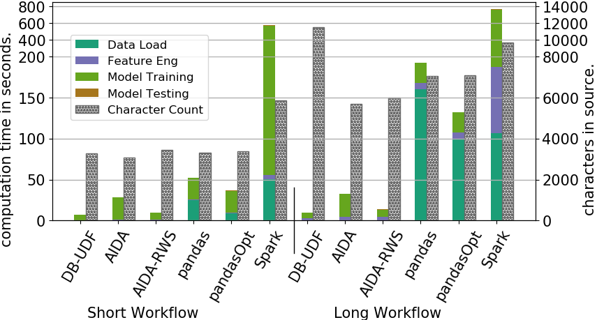

# Linear Regression Benchmark Workflows repository
## For the VLDB 2018 Research Paper 
## _AIDA - Abstraction for Advanced In-Database Analytics_

We have used the data captured by Montréal's public bicycle system, [Bixi](https://montreal.bixi.com/en) in these linear regression workflows.

The data set used consists of the trip and station data for 2017 which is available at [kaggle](https://www.kaggle.com/aubertsigouin/biximtl/data). The Google maps data for distance between stations were produced using [Google maps'  distance matrix API](https://developers.google.com/maps/documentation/distance-matrix/start).

The workflows for AIDA and pandas are as Jupyter notebooks, a common method of interactive development and exchange used among the data science community. We have formatted the workflows for Spark and database UDFs using github's markdown fileformat so that it is easy to read/format the source code along with the output results it produces.

* There are the basic workflows which demonstrate how an _oracle_ with the complete knowledge of the data and knows the final model to be trained would write the workflow.

  - [BixiLinearAIDA-Basic.ipynb](BixiLR/BixiLinearAIDA-Basic.ipynb) : This workflow is written using AIDA's client API.
  
  - [BixiLinearAIDA-RWS-Basic.ipynb](BixiLR/BixiLinearAIDA-RWS-Basic.ipynb) : A modified version of the above workflow, where the iteration logic is executed using AIDA's remote workspace execution operator.
  
  - [BixiLinearPandas-Basic.ipynb](BixiLR/BixiLinearPandas-Basic.ipynb) : Similar workflow logic, written using pandas. The data required to perform the workflow is fetched from the database by executing the SQL that contains any necessary joins within the database (pushdown concept). The database connection used is not manually tuned for large data sets, and therefore it experiences a larger data transfer time between the database and the client.

  - [BixiLinearPandasOpt-Basic.ipynb](BixiLR/BixiLinearPandas-Basic.ipynb) : An optimized version of the above pandas workflow. In this case the database connection is explicitly optimized for large data transfer buffers to reduce the time it takes to load data.
  
  - [BixiLinearDBUDF-Basic.md](BixiLR/BixiLinearDBUDF-Basic.md) : The entire workflow logic as a whole is written into a database UDF. In this approach, the user has no way interact with any of the intermediate objects or produce any intermediate outputs.
  
  - [BixiLinearSpark-Basic.md](BixiLR/BixiLinearSpark-Basic.md) : Workflow for Spark, written in Scala.

* The next set of workflows demonstrate a more pragmatic exploratory path that a data scientist might follow, often making decisions and "excursions" in various directions before settling on the final solution. In our simple example, the data scientist first computes an approximate distance between two stations by means of their GPS coordinates and [Vincenty's formulae](https://en.wikipedia.org/wiki/Vincenty%27s_formulae) and uses it to predict the duration of the trips. They do a couple of iterations to test the error of the classifier. Next they try to perform the prediction using the distance matrix provided by the Google maps API. Upon observing the error rate of this approach to be the least of the two, they then decide to perform the model training using this approach.

  - [BixiLinearAIDA.ipynb](BixiLR/BixiLinearAIDA.ipynb) : This workflow is written using AIDA's client API.
  
  - [BixiLinearAIDA-RWS.ipynb](BixiLR/BixiLinearAIDA-RWS.ipynb) : A modified version of the above workflow, where the iteration logic is executed using AIDA's remote workspace execution operator.
  
  - [BixiLinearPandas.ipynb](BixiLR/BixiLinearPandas.ipynb) : Same workflow logic, written using pandas. However, since the data scientist needs to "peek" and "analyze" each data sets and transformations, the individual tables get loaded into pandas, which also results in relational joins being performed in pandas, as the data sets are already on the client side. The database connection used is not manually tuned for large data sets, and therefore it experiences a larger data transfer time between the database and the client.

  - [BixiLinearPandasOpt.ipynb](BixiLR/BixiLinearPandas.ipynb) : Same workflow logic, written using pandas. In this case the database connection is explicitly optimized for large data transfer buffers to reduce the time it takes to load data.

  - [BixiLinearDBUDF.md](BixiLR/BixiLinearDBUDF.md) : The workflow is written as a mixture of SQLs executed using a regular database client and a set of database UDFs that the user writes when there is a need to perform linear algebra. There is some small duplication of processing and source code statements due to the restrictive nature of database UDFs that does not allow host language objects (such as NumPy array) or function definitions to be used across different UDF invocations.

  - [BixiLinearSpark.md](BixiLR/BixiLinearSpark.md) : Workflow for Spark, written in Scala.

## Performance and Usability Characteristics.

|	| Language Expertise |	Interactive System |	Incremental Exploration Possible |	"Near-data" Computation |
|---|---|---|---|---|
| __AIDA__ |	Python |	Yes |	Yes |	Yes |
| __Database UDF__ |	Python, SQL |	No	| No |	Yes |
| __pandas__	| Python	| Yes	| Yes |	No |
| __Spark__ |	Scala	| Yes	| Yes |	No |
